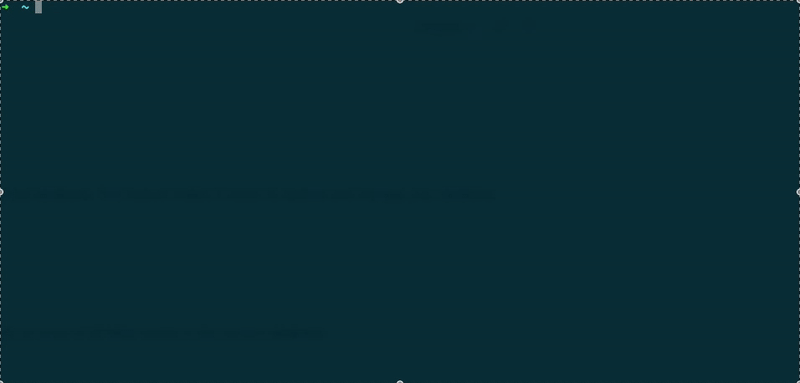

# ChainDB CLI

A command-line interface (CLI) to interact with [ChainDB](https://github.com/wpdas/chain-db), a database with change history tracking.



> **Note for Developers**: If you're working on the ChainDB CLI project, please check the [DEVELOPMENT.md](./DEVELOPMENT.md) file for instructions on how to set up your development environment and test the CLI locally.

## Requirements

- Node.js version 20.18.3 or higher

## Installation

### Global Installation

```bash
npm install -g chain-db-cli
```

### Local Installation

```bash
npm install chain-db-cli
```

## Configuration

Before using the CLI, you need to configure the ChainDB host:

```bash
# Local Chain DB (you will need to donwload and run the the chain db binary on your OS)
# You can pick a binary here: https://github.com/wpdas/chain-db?tab=readme-ov-file#download
chaindb config --host http://localhost:2818
# Chain DB Test Server: (may not be always available)
chaindb config --host https://gull-dominant-mistakenly.ngrok-free.app
```

Or without parameters to use interactive mode:

```bash
chaindb config
```

## Usage

### Database Commands

#### Create a database

```bash
chaindb db create --name my_database --user admin --password mypassword
```

#### Connect to a database

```bash
chaindb db connect --name my_database --user admin --password mypassword
```

#### Change database password

```bash
chaindb db change-password --name my_database --user admin --old-password oldpassword --new-password newpassword
```

### Table Commands

#### List all tables

```bash
chaindb table list
```

#### Get current table data (the last record stored in the table)

```bash
chaindb table get users
```

#### Get a specific record by document ID

```bash
chaindb table get-by-id users --doc-id "550e8400-e29b-41d4-a716-446655440000"
```

#### Update a record by document ID

```bash
chaindb table update users --data '{"name": "John", "age": 30}' --doc-id "550e8400-e29b-41d4-a716-446655440000"
```

**Important**: When updating a record, the new data completely replaces the existing data. There is no merging of properties. If you want to preserve existing properties, you must include them in your update request.

For example, if your record has:

```json
{
  "name": "John",
  "age": 30,
  "city": "New York",
  "doc_id": "550e8400-e29b-41d4-a716-446655440000"
}
```

And you update it with:

```json
{
  "age": 31
}
```

The resulting record will be:

```json
{
  "age": 31,
  "doc_id": "550e8400-e29b-41d4-a716-446655440000"
}
```

The `name` and `city` properties are lost because the update completely replaces the data. To preserve these properties, include them in your update:

```bash
chaindb table update users --data '{"name": "John", "age": 31, "city": "New York"}' --doc-id "550e8400-e29b-41d4-a716-446655440000"
```

#### Persist new data to table

```bash
chaindb table persist users --data '{"name": "John", "age": 30, "city": "New York"}'
chaindb table persist users --data '{"name": "Mary", "age": 25, "city": "Los Angeles"}'
```

#### Get table history

```bash
chaindb table history users --limit 10
```

#### Search records with simple criteria

```bash
chaindb table find users --criteria '{"name": "John"}' --limit 10
```

#### Search records with advanced criteria

```bash
chaindb table find-advanced users --criteria '[{"field": "age", "operator": "Gt", "value": 25}, {"field": "name", "operator": "Contains", "value": "Jo"}]' --limit 10
```

## Advanced Search Operators

- `Eq`: Equal to (==)
- `Ne`: Not equal to (!=)
- `Gt`: Greater than (>)
- `Ge`: Greater than or equal to (>=)
- `Lt`: Less than (<)
- `Le`: Less than or equal to (<=)
- `Contains`: Contains (for strings and arrays)
- `StartsWith`: Starts with (for strings)
- `EndsWith`: Ends with (for strings)

## Examples

### Example 1: Create a database and add data

```bash
# Configure the host
chaindb config --host http://localhost:2818

# Create a database
chaindb db create --name my_database --user admin --password 1234

# Connect to the database
chaindb db connect --name my_database --user admin --password 1234

# List all tables in the database
chaindb table list

# Persist data to a table
chaindb table persist users --data '{"name": "John", "age": 30, "city": "New York"}'
chaindb table persist users --data '{"name": "Mary", "age": 25, "city": "Los Angeles"}'

# Get current data (the last record stored in the table)
chaindb table get users

# Get a specific record by document ID
# chaindb table get-by-id users --doc-id "550e8400-e29b-41d4-a716-446655440000"

# Update a record by document ID
# Note: This completely replaces the existing data, so include all properties you want to keep
# First, get the record's doc_id using get or get-by-id commands
# Then update the specific record:
# chaindb table update users --data '{"name": "John Smith", "age": 31, "city": "New York"}' --doc-id "550e8400-e29b-41d4-a716-446655440000"

# Get history
chaindb table history users --limit 10
```

### Example 2: Advanced search

```bash
# Search for users with age greater than 25
chaindb table find-advanced users --criteria '[{"field": "age", "operator": "Gt", "value": 25}]'

# Search for users who live in New York and have "Jo" in their name
chaindb table find-advanced users --criteria '[{"field": "city", "operator": "Eq", "value": "New York"}, {"field": "name", "operator": "Contains", "value": "Jo"}]'
```

## License

MIT
